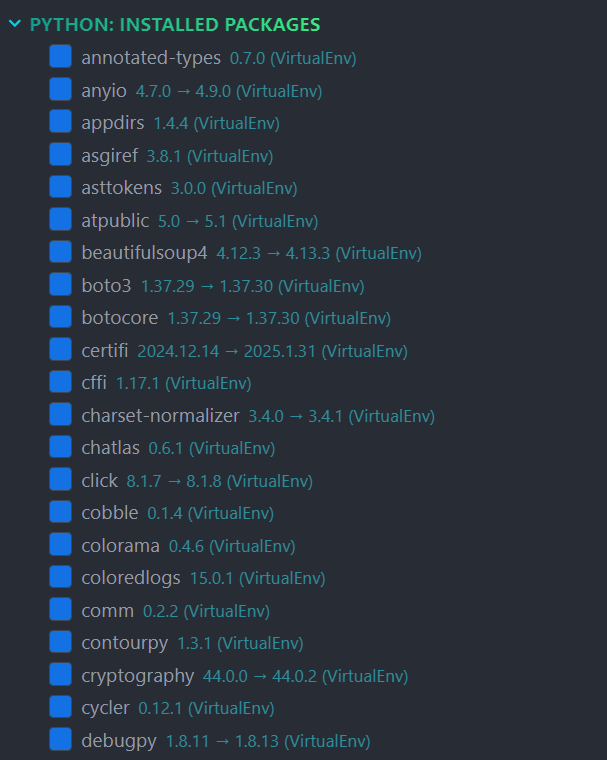

# 📦 Positron R Package Manager

Manage your Python extensions from within [Positron](https://positron.posit.co/) — the RStudio-style package manager for the modern data science IDE.

---

## 🚀 Features

- ✅ View all **installed Python packages** in a tidy sidebar
- ✅ **Install** packages directly from pane
- ✅ **Uninstall** packages with a single click
- ✅ 🔍 **Search** by name or title (fuzzy search supported)

---

## 🛠 Requirements

- Positron version `2025.04.0-250` or later
- `pip` must be installed in the Python runtime (used for data exchange).
- Python installed and working inside Positron
- This extension must run in the **workspace** (remote/WSL/container supported ✅)

---

## ⚙️ Extension Settings

This extension currently has no user-facing settings — it's fully automatic.

---

## ⚠️ Known Issues

- Unable to check the box to attach/detach the package. Importing python package usually requires to be declared explicitly
- Clicking on package's name doesn't show its documentation in Help pane due to the different in package name and module imported. For example, the package name is pyjanitor but it is imported as `import janitor`

---

## 🙏 Attribution

Created by [ntluong95](https://github.com/ntluong95)  
Licensed under the [MIT License](./LICENSE)

---

## 💡 Future Ideas

- [ ] Update package to a specific version
- [ ] Display package description

---

## 🧠 Why Positron?

Because it’s time for a modern, polyglot, VS Code-based Data Science IDE — and this extension brings one of RStudio's most beloved panels to the future.
